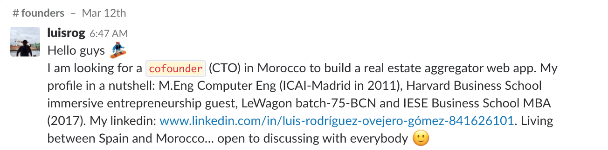

# Begin your entrepreneurial journey

So you want to be an entrepreneur? That's awesome! You'll be joining hundreds of Le Wagon alumni who have already gone on to build amazing companies.

There are quite a few things to keep in mind so let's get right to it.

## Before you start 💡

Validate your idea:
- Build a landing page where you clearly explain your 3-5 amazing features
- Add a mailing list plugin or even a sign up form (which then saves the customer data and redirects them to a page stating "Due to the extremely high interest we are currently onboarding only a select number of customers per day. We will be in touch as soon as it's your turn").
- Take €100 - 200 and buy super-targeted Facebook ads (with at least 10 different headlines, images and texts) linking to your landingpage.
  - 1. Look at the click-through rate - anything above 3% is good
  - 2. Look at the conversion rate (how many people give you their email / sign up) - anything above 5% is good.

You can also invite 30 strangers for coffee or call 30 companies and talk to the person who would use your product - but make sure you validate your idea before you begin fully!

## Just start! 🚀

The most important lesson is just to go for it and start. Do you know what's worse than a half-finished, imperfect, occasionally prototype? Someone who is only ever talking about their idea and never actually doing anything!
Everybody has ideas. What sets you apart as an entrepreneur is that you act on them and **start building it**. Before you did Le Wagon, you probably had the excuse that you didn't know how to build it. Well now you do, so what are you waiting for!

Oh - and don't forget to join our [#founders Slack channel](https://lewagon-alumni.slack.com/messages/C3YMNF77A) and of course you can always get some love in our [#pay-it-forward channel](https://lewagon-alumni.slack.com/messages/C0X6A3EN7)

Your MVP should do one thing: Prove your main assumption(s) right or wrong (hopefully right!). Therefore, you want to focus on the subset of your customers that are most likely to value your product the most. If you haven't yet, now is the time to very quickly read through the [Lean Startup Method](http://theleanstartup.com/principles) and its build-measure-learn process.

Don't be afraid if you're idea has been done before. Google was not the first search engine (Yahoo had already "won" that market) and who needs Facebook if you've got MySpace?! You can always be different and better.

Last, don't worry about scalability - if your problem is that your servers are going down that means you're gaining real traction and only then it's time to invest a lot of thought (and money) into this issue. You want to get your product in front of your customers and they really couldn't care less about your amazing distributed servers and beautifully configured load balancer.

## Co-Founder 🕵️‍♂️

To look for a cofounder we recommend to search in le Wagon community : 

- fill out this [form](https://airtable.com/shr53HOpV9JdcKa7L) and check the [list](https://airtable.com/shr1tCU4jCUi2HcQw) to see who else is looking for a co-founder!  
- do networking at le Wagon events! Find the event calendar on [meetup](https://www.meetup.com/fr-FR/find/?allMeetups=false&keywords=le+wagon&radius=Infinity&userFreeform=Paris%2C+France&mcId=z1011740&mcName=Paris%2C+FR&sort=recommended)
- introduce yourself on slack on the channel **#founders** like Luis 👇

- Finally dont hesitate to tell [Le Wagon's staff](https://kitt.lewagon.com/alumni/staff) that you are looking for a cofounder and they will try to introduce you to the right alumni.

## Financing 💰

Many "entrepreneurs" (especially from a business background) create beautiful 200-slide PowerPoint presentations and sophisticated Excel models with financial plans for the first 10 years of their business. The catch? No investor will ever look at slide 15 - 200. And they will never use your Excel model - they will build their own. Most people need to apply for funding because they need money to develop a product. But YOU know how to code 🎉! Make a rough estimate of your living costs (salary, rent, heroku, pet food...), and calculate how much you need to sell to cover these costs and then **get on with coding your product**. Because that's what sets you apart.

Le Wagon was founded with €1,000 and never took any financing. If we can do it, you can do it!

Once you've got an MVP and you really think you need the money, any investor will be much more happy to give it to you with a working prototype and a pool of paying customers than any amount of slides. Just make sure to read [Venture Deals: Be Smarter Than Your Lawyer and Venture Capitalist](https://www.amazon.com/Venture-Deals-Smarter-Lawyer-Capitalist/dp/1119259754/ref=dp_ob_title_bk) first.

Check out 🌎 [VC's list](../data/vcs.csv)

## Legal setup ⚖️

Don't worry too much about the legal setup initially. Create a sole proprietor, or, if you're more than one founder a partnership under the civil code and get started.
The one thing you do want though if you're more than one founder is a shareholder agreement with [vesting](https://thenextweb.com/entrepreneur/2013/07/21/startup-founders-heres-why-vesting-is-your-best-friend/) for each of the founders.

## Perks 🤙

Make sure to check out our [Perks](https://github.com/lewagon/career/blob/master/articles/perks.md) including AWS credits, Stripe discounts and much more 💰.

## Accelerators / Incubators 🤝

Looking for an accelerator / incubator? Check this [list](https://github.com/lewagon/career/blob/master/data/accelerators_incubators.csv)

---

That's it! You can now go back to the [Homepage](https://github.com/lewagon/career#readme) of this career playbook.

