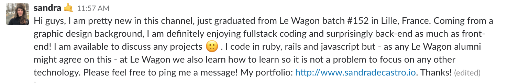
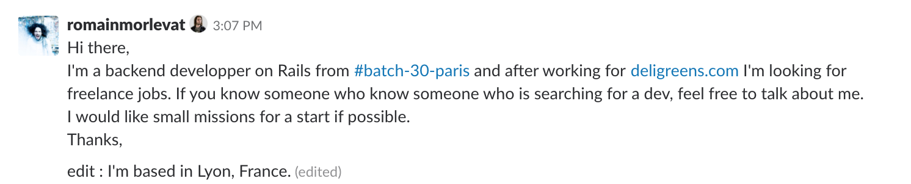
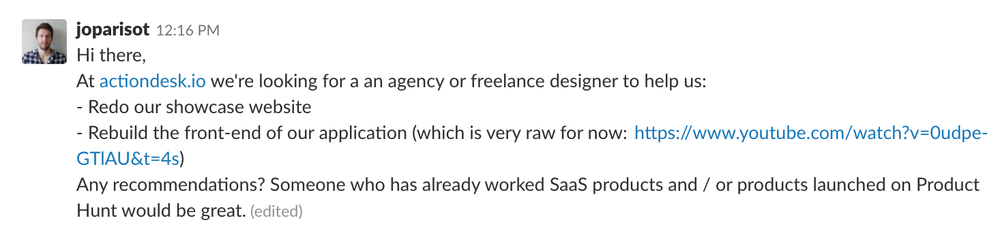

# Kickstart your freelance career

Did you already read Freecodecamp's [Freelancing 101](https://www.freecodecamp.org/news/freelancing-101/)?

Here are some more freelance tips for beginners 👇

(If you want to become a freelance **web developer** start by reading [this](job_developer.md))

## Look for clients 👀

- **Start by activating your close network (family, friends, former colleagues)**

The first step is always to reach out directly to your close network to let them know that this is what you're doing. Explain your situation and offer your services. Tell your **friends on Facebook** and **LinkedIn** too "Hey I've just finished Le Wagon and I'm now a freelance developer. I can build awesome websites and am ready to start on projects immediately. Are you interested or do you know anyone who might be looking for someone to help them build a website?"

- **Check out the #freelancers channel on Slack**

Look at the [#freelancers](https://lewagon-alumni.slack.com/messages/C3ZFB57EG) channel on Slack every day. A lot of alumni share jobs on here.
You can also introduce yourself and tell the comunity that you are looking for freelance opportunities and share your portfolio.

Introduce yourself like Sandra or Romain :

Share a job like Jonathan :

- **Go on job platforms**

They will ask you to fill out a profile, explain what you are doing, define a rate etc. It's a very useful way to market yourself! You can also benchmark with other people, see what they are selling, how much they are charging ..

[Here](https://github.com/lewagon/career/blob/master/data/gig_platforms.csv) are all the job platforms

- **Go to meetups**

Be an active member of the ecosystem you are in. Immersing yourself in the freelance ecosystem will help you to find clients. Go to talks, meetups... Check them on [meetup.csv](https://github.com/lewagon/career/blob/master/data/meetups.csv)

🧐 Go further and learn from some lead teachers @ Le Wagon:

- Jad Joubran's [7 steps to get more clients as a freelance developer](https://medium.com/@JoubranJad/7-steps-to-get-more-clients-as-a-freelance-developer-ee00342f9260)
- Maria Altyeva's guides [How to get paid for your work](https://medium.com/@mariacodes/freelancing-101-how-to-get-paid-for-your-work-fac40c583824) and [The tools you need to manage your clients](https://medium.com/@mariacodes/freelancing-101-the-tools-you-need-to-manage-your-projects-and-your-clients-cae9167da546)

## Manage your mission 👌

- **Accept the first (paid) gig**

Accept the first offer, even if it's not paid well (dont accept if it's not paid at all!). The hardest part is getting the very first customer. Once you have your first customer, if you do a good job you will have work to show and quickly be able to grow your client base.

- **Find the right rate**

Ask yourself these questions:
1. How much value can you provide to your client? Usually Le Wagon Alumni for a first freelance mission charge between 200€ and 300€/day, but remember, you aren't a senior dev yet!
2. Look at the budget of your client (a startup will have less budget than a big corporate)
3. The interest you have in the mission

- **Choose only **short missions**(not more than 2/3 weeks)!**

- **Take care of your first clients**

It's very important that your first client is happy. Finish the mission, even if it takes longer, or takes more days than you expected.
If the client doesn't like your work, refund the money unless you have a very good reason not to. If you tarnish your reputation right at the start of your freelance career, you won't get very far!

## Get the right legal status 🤓

To be allowed to write invoices you will most likely need to **create a new legal status**! This depends on the country you are in. In France you have "auto entrepreneur" the best status to begin your freelance career (you can bill up to 32k euros and you get 23% tax on that. If you are young you can lower that tax at 7% the first year).Also it's very important to **get health insurance**.

To easily create your new status and get health insurance check out in the [freelance services](https://github.com/lewagon/career/blob/master/data/freelance_services.csv)

## Get the freelance lifestyle 😎

- **Place to work from**

When you are a freelancer you can decide to work from your house. We dont recommend that. You are much better off choosing something like a co-working space / café (check the list on accelerators/co-working spaces. It's important to meet people, or even just to be around other people in a professional space.

- **Have a routine**

Wake up every day at the same time. Set your alarm. Find activities that you enjoy that will help you split up and structure your day (swimming, gym, lunch with friends, meditation). Don't work all the time! Try sprints of one or two hours. When you feel your productivity going down, take a break. Finally remember to take time off (weekends and holidays). They will help you be a happier and more productive worker!

- **Find your team**

**Team up with other people to work on a project**, for example a friend you made on your batch who you like and worked well with :) It's important for the motivation!

- **Bonus: travel the world**
Some alumni became digital nomads after Le Wagon. They travel the world while working remotely for there clients. Check [this article](https://medium.com/@damien.lethiec/becoming-freelance-digital-nomad-after-le-wagon-3b1704d33145) to learn how.

