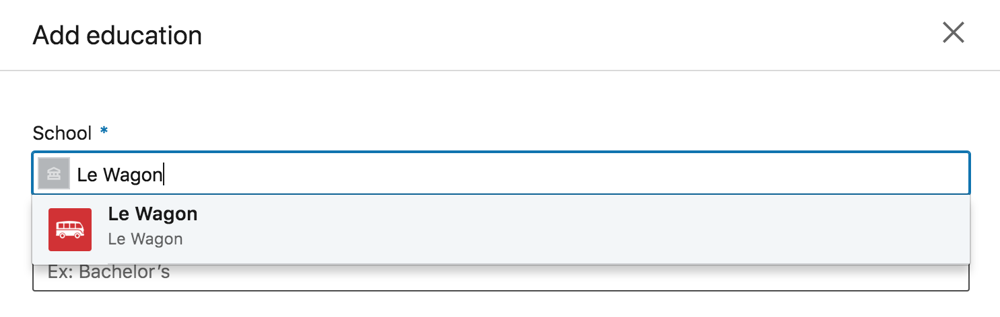
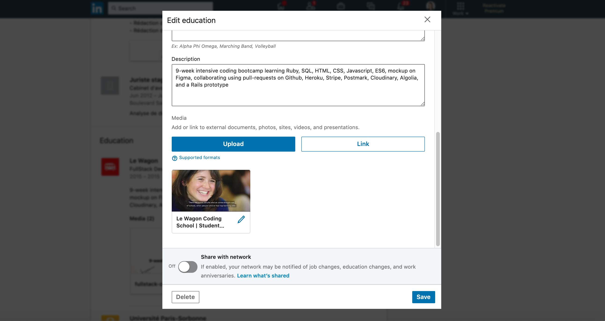
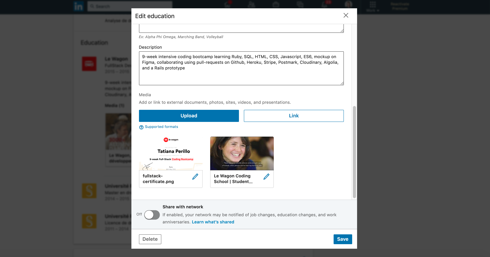

# Boost your Linkedin profile with Le Wagon

## Adding LeWagon to Your Linkedin Profile:

Go to your [LinkedIn](https://www.linkedin.com/) profile.

First, _remove_ any mention of Le Wagon in the **Experience** section. You didn't work at Le Wagon, you studied there!

Now, scroll down to the **Education** section, and click on `+`


In the `School` field, start typing `Le W` and **Le Wagon** should show up. Click on the list item that has appeared beneath it. It's important to click on it to actually link your profile to our [School profile](https://www.linkedin.com/school/le-wagon/) on Linkedin.

 

Now that you have the basics set up, it's time to fill in the other fields. We suggest that you use the following information:

| Degree                 | Full-Stack Web Developer                                |
|------------------------|---------------------------------------------------------|
| Field of Study         | Computer Programming (from the autocomplete list)       |
| Grade                  | _Leave blank_                                           |
| Activities & Societies | _Leave blank_                                           |
| From Year & To Year    | The year of your bootcamp! 2018?                        |


For the description field you can use this:

⚠️ _Don't blindly copy/paste! Replace the `$...` variables with the relevant values_

```
Attended Le Wagon $CITY (Batch #$SLUG).

9-week intensive coding bootcamp learning HTML, CSS, Bootstrap, JavaScript ES2015,
SQL, git, GitHub, Heroku and Ruby on Rails. Designed, implemented and shipped to
production a clone of AirBnB and a Rails prototype of $URL_TO_YOUR_PROJECT.

My GitHub profile: $URL_TO_YOUR_GITHUB_PROFILE
```

## Thinking Like a Recruiter 101:

**What do recruiters consider?**

1. Requirements: Candidate has knowledge
2. Culture: Does Candidate work with our company culture?
3. Logistics: Can Candidate get to the job easily
4. Retention: How long will Candidate stay?

## Tips to make your Linkedin Profile awesome

Have a look at our [Linkedin Workshop slide deck](https://docs.google.com/presentation/d/1yggy_Fp6BRLvyxF8dz9Y_7_I43xmimv0ZPqNFi8hFCg/edit?usp=sharing) and follow the steps to improve the quality of your profile and considerably increase your visibility.

## Linkedin Profile

**Title:** Make it a phrase, not just a boring title.

**Your Profile summary:**

**Simple template for summary:** Sums up --> I want to do X at Y company because of Z.

Summary is the what and why

What = the knowledge you have

Why = What kind of culture are you looking for. === Retention at the company. Someone looking to hire you wants to know that you're gonna stay.

**Curate your profile for the job you want not the job you have.**

Make sure your profile says: **This is who I am**

Job Title = Your Knowledge

**Position description/phrase:** Instead of Fullstack Developer → Creating amazing applications for the good of humanity(make it a phrase, not bland).

**Your location**

Update your location

**Add all Skills you have to skills area(recruiters/hiring managers do look here)**

Go to jobs tab and fill out form on open to new opportunities(very important).

**Add your dev or design Portfolio to profile**

**Get Referrals from friends → Referrals boost changes of interviews**

**Profile needs to scream the title you have**

Want to be a UX researcher? Fullstack dev? etc. etc.

Your picture has to be in line with whatever job you want!

Very important: Have a centered headshot of you. Not a zoomed out picture. It goes a long way.

Hope that helps ❤️


## Bonus: Adding Some Media

You can **enrich your profile with links** to your portfolio, your blog, etc. Also, here is **short Video** explaining what Le Wagon is so that anyone browsing your profile can quickly grasp what you learned. Copy/paste this link:

:point_right: [https://www.youtube.com/watch?v=Du0eKxOrLsQ](https://www.youtube.com/watch?v=Du0eKxOrLsQ)



You can also upload your fullstack certificate 👇




---

And that's it! Once your Linkedin profile is updated, find out [how to use Kitt after the Bootcamp](kitt.md).
