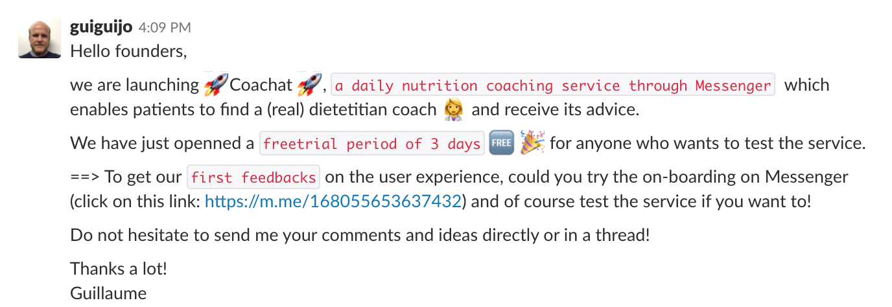
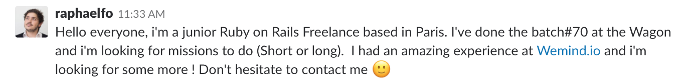
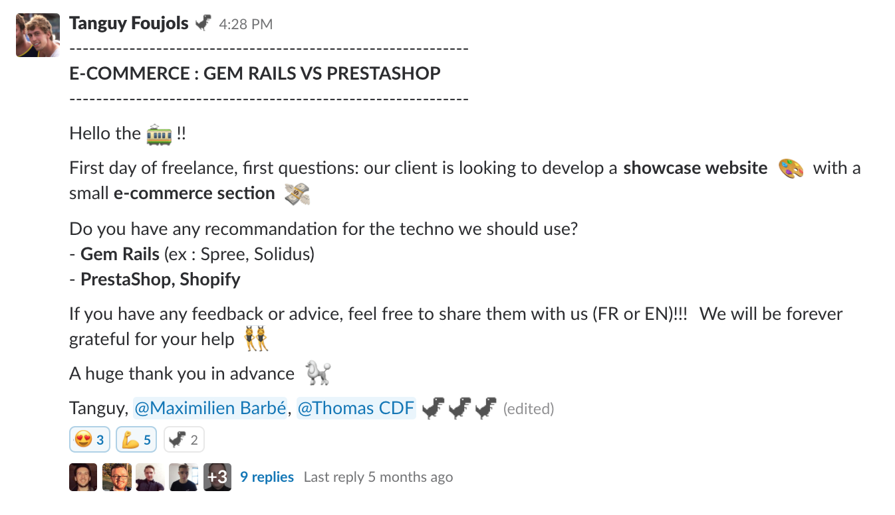

# How to benefit from Le Wagon Alumni's slack group

## Join some channels

Here are some public channels you may want to join depending on your interests:

- [#career](https://lewagon-alumni.slack.com/messages/career)
- [#design](https://lewagon-alumni.slack.com/messages/design)
- [#founders](https://lewagon-alumni.slack.com/messages/founders)
- [#freelancers](https://lewagon-alumni.slack.com/messages/freelancers)
- [#help](https://lewagon-alumni.slack.com/messages/help)
- [#javascript](https://lewagon-alumni.slack.com/messages/javascript)
- [#jobs](https://lewagon-alumni.slack.com/messages/jobs)
- [#linux](https://lewagon-alumni.slack.com/messages/linux)
- [#pay-forward](https://lewagon-alumni.slack.com/messages/pay-forward)
- [#product](https://lewagon-alumni.slack.com/messages/product)
- [#resources](https://lewagon-alumni.slack.com/messages/resources)
- [#ruby](https://lewagon-alumni.slack.com/messages/ruby)

You may also want to join city channels like [#bali](https://lewagon-alumni.slack.com/messages/bali) or [#london](https://lewagon-alumni.slack.com/messages/london) to hang out with the local crowd.

The rules are simple: the only channel where you are allowed to use `@channel` or `@here` is `#pay-forward`. In **all other channels**, you **must not** use them 🚫. Using `@channel` in Le Wagon channels sends notifications to hundreds (and even thousands) of alumni all over the world, all in different timezones. Waking someone up at 3am is not the best start when you're asking for help 🙈. Finally, remember to always **speak English :uk:**. Thank you :pray:

## Tips when joining a channel

**Don't be shy**! Introduce yourself, tell the community a bit more about your projects and about what you're looking for. For instance:

- Introduce your startup on the [#founders](https://lewagon-alumni.slack.com/messages/founders) channel

- Tell others what you're looking for on the [#jobs](https://lewagon-alumni.slack.com/messages/jobs) channel

- Ask for some help on the [#freelancers](https://lewagon-alumni.slack.com/messages/freelancers) channel

**It's very important to be active on Slack**.

You will be able to **connect with alumni all over the world**, ask `@edouardf` to create new public channels on specific topics, get upvotes on your personal project when pushing on Product Hunt and most importantly **find many job or freelance opportunities**.

---

And that's it! Once you have joined some Slack channels, have a look at some of the cool [Le Wagon's perks](perks.md).
